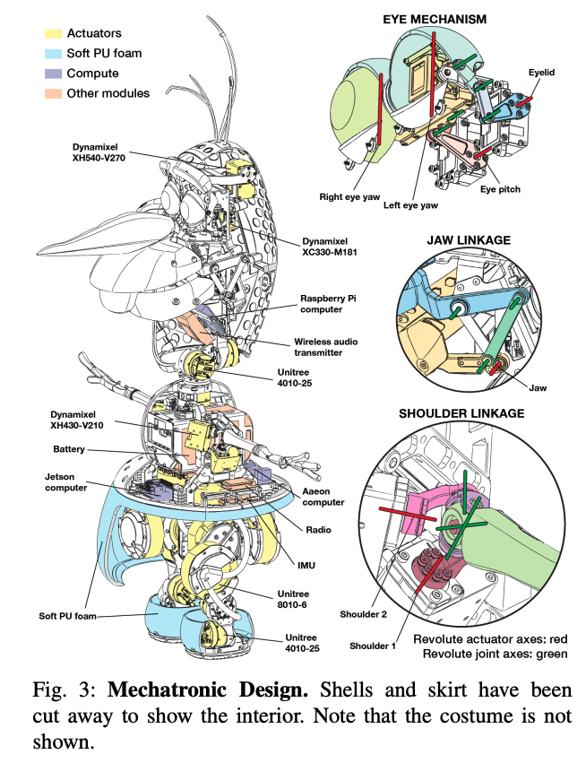

# Olaf Robot のHW構成

[Olaf: Bringing an Animated Character to Life in the Physical World](https://arxiv.org/pdf/2512.16705)

Olaf Robotが盛り上がっている。
こういったロボットではどういったコンピュータが搭載されるのか気になるので目を通した。

## 全体像
本論は専門外なので、軽くまとめるに留める。
#### 背景
- ロボットはfunctionality, robustness, efficiencyが重視されてきた
- しかし人間と交流するロボットではその限りではない
- believability と character fidelity (忠実度) が重要

#### 目的・課題
- 目的：Olafを現実世界で動かす
- 障壁：Olafはロボットとして実現するには厳しい条件
  - 頭が大きい、足が小さい、アニメ調の動き方
  - small inconsistenciesでもbelievabilityが損なわれる

#### 貢献
- mechatronic design
  - 非対称な脚 (対照な脚だとオラフの胴体内で干渉するらしい)
  - 腕・口・目はremote actuationしてモータを見せない
- 過熱を考慮したポリシー
  - 温度をシミュレーションに組み込み、reinforcement learning の報酬として追加
- believabilityを高めるための報酬
  - 硬い足音を抑えるため、ノイズをペナルティ
  - 左右の足の衝突をペナルティ

## HW構成

- on-board computerとして以下の3台を搭載：
　- Raspberry Pi
  - Jetson
  - Aaeon
- actuator:
  - Unitree (シリアルRS-485で通信)
  - Dynamixel (RS-485 or TTLで通信)
- sensor:
  - IMU
  - カメラ類はなさそう
- 全体で14.9 kg

マイコンは搭載されていなさそう。
sensor類はGPIOピン経由でSPIでコンピュータと接続、sensorの入力を元に推論+出力値計算、シリアル経由でactuatorに送信？